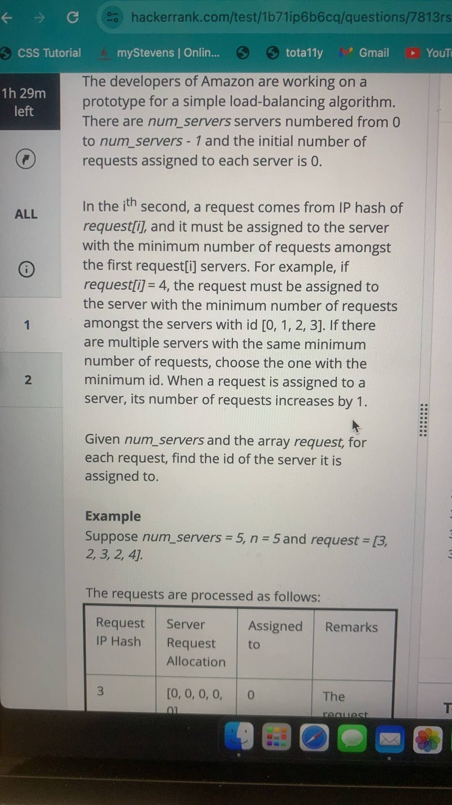
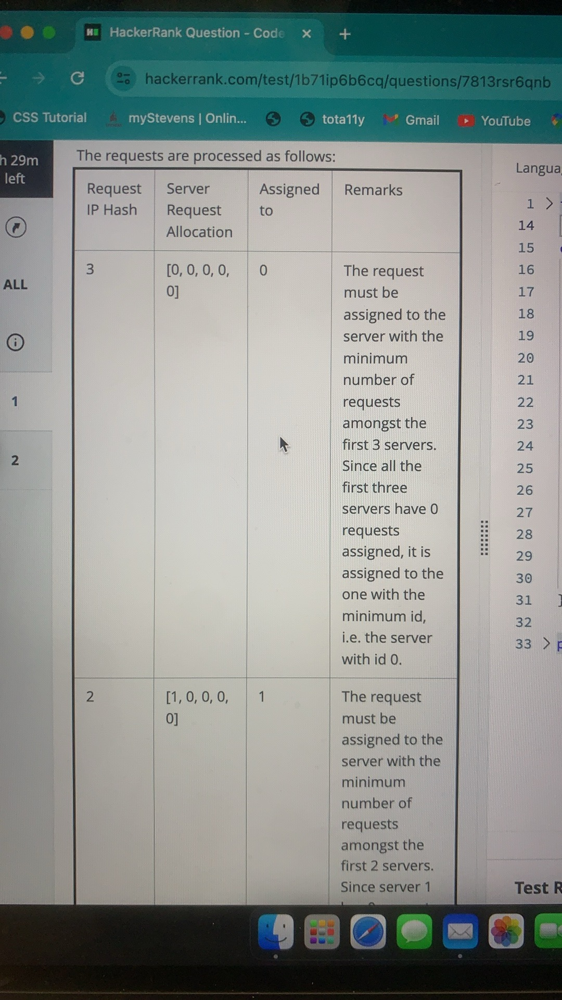
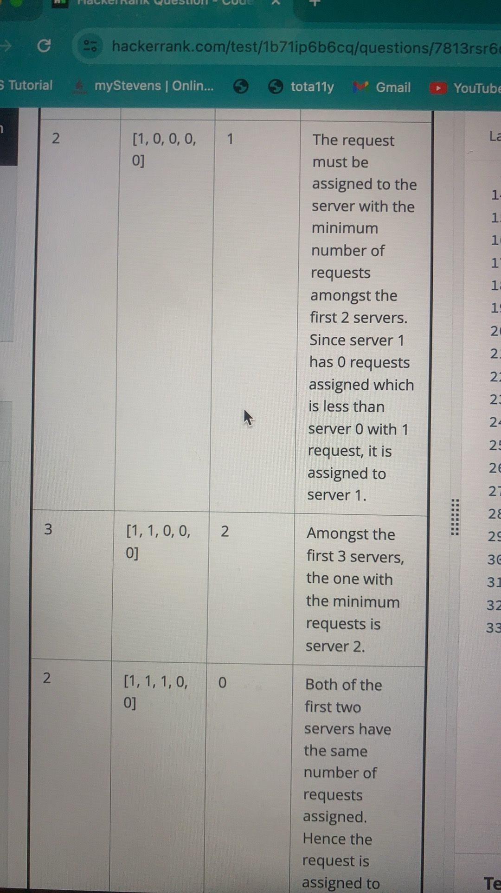
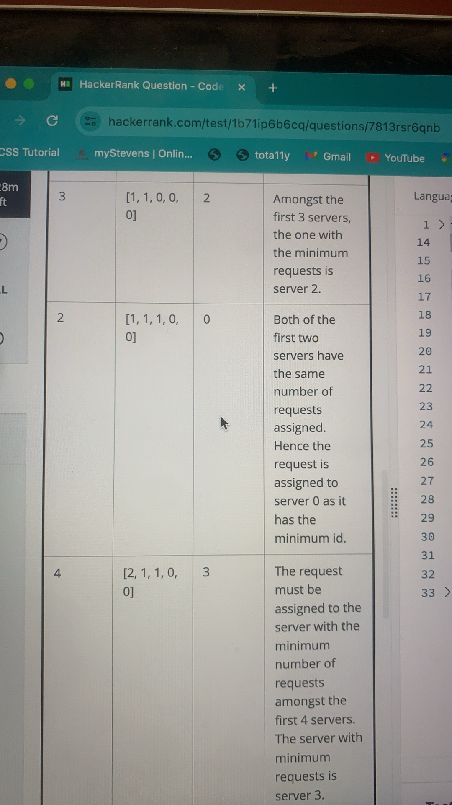
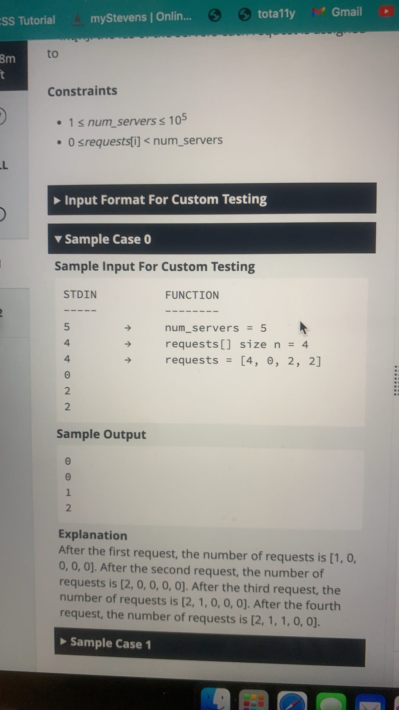

// "static void main" must be defined in a public class.
public class Main {
    public static void main(String[] args) {
        
        List<Integer> input = new ArrayList<>();
        // input.add(4);
        // input.add(0);
        // input.add(2);
        // input.add(2);
        
        input.add(3);
        input.add(2);
        input.add(3);
        input.add(2);
        input.add(4);
        
        List<Integer> ans = getServerIds(5,input);
        
        for(int i = 0; i < ans.size(); i++) {
            System.out.println(ans.get(i));   
        }
    }
    
    private static List<Integer> getServerIds(int num_servers, List<Integer> request) {
    int [] servers = new int[num_servers];
    int len = request.size();
    List<Integer> res = new ArrayList<>();
    for(int i = 0; i < len; i++) {
        int n = request.get(i);
        int minLoad = Integer.MAX_VALUE;
        int activeId = -1;
        for(int j = 0; j <= n; j++) {            
            if(servers[j] < minLoad ) {
                minLoad = servers[j];
                activeId = j;
            }
        }
        res.add(activeId);
        servers[activeId]++;
    }
    return res;
    }
}

	•	时间复杂度: O(n * num_servers)
	•	空间复杂度: O(num_servers + n)

