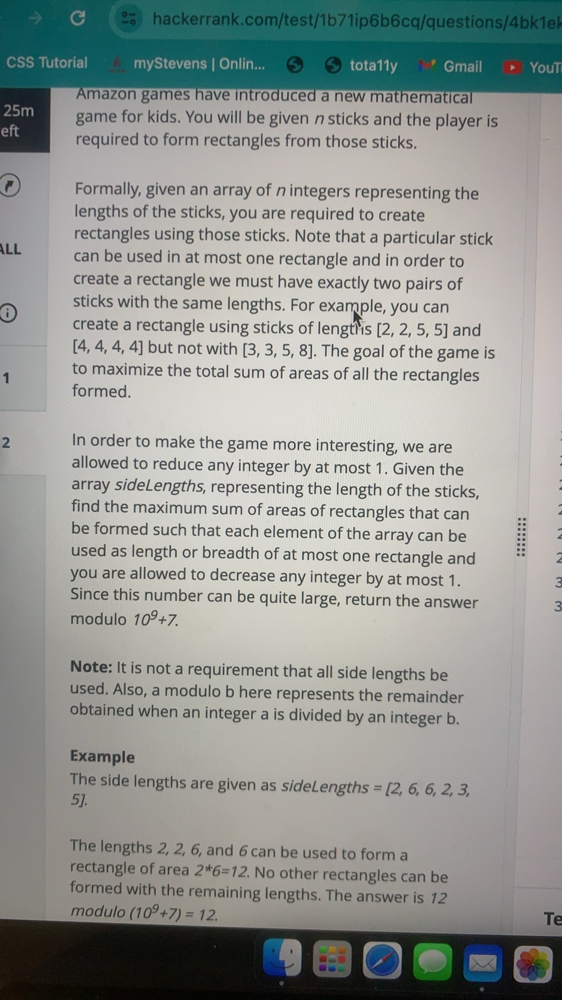
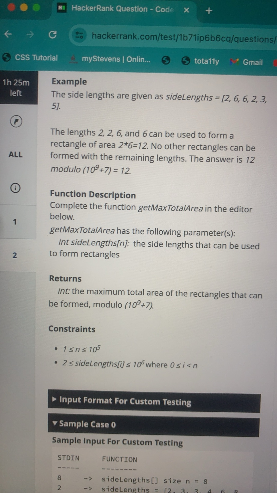
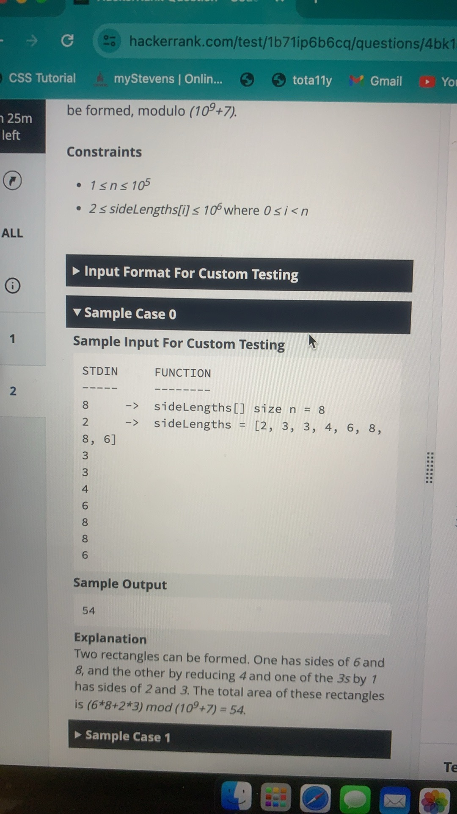
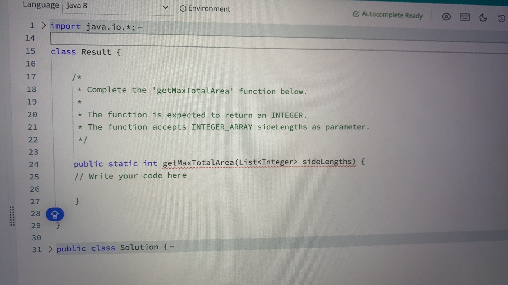

// "static void main" must be defined in a public class.
public class Main {
    public static void main(String[] args) {
        List<Integer> ls = new ArrayList<>();
        ls.add(2);
        ls.add(6);
        ls.add(6);
        ls.add(2);
        ls.add(3);
        ls.add(5);
        int res = getMaxTotalArea(ls);
        System.out.println(res);
        
    }
    
    public static int getMaxTotalArea(List<Integer> sideLengths) {
        Collections.sort(sideLengths);
        long length = 0;
        long sumArea = 0;
        int MOD = 1000000007;
        
        int i = sideLengths.size() - 1;
        while(i > 0) {
            if (Math.abs(sideLengths.get(i) - sideLengths.get(i-1)) <= 1) {
                if (length == 0) {
                    length = Math.min(sideLengths.get(i), sideLengths.get(i-1));
                    i--;
                } else {
                    long area = length * Math.min(sideLengths.get(i), sideLengths.get(i-1));
                    sumArea += area;
                    sumArea %= MOD;
                    length = 0;
                    i--;
                }
            }
            i--;
        }
        return (int)sumArea;
    }
}

## 时间空间复杂度
	1.	排序：
	•	Collections.sort(sideLengths) 的时间复杂度是 O(n log n)，其中 n 是 sideLengths 列表的大小。
	2.	遍历列表：
	•	while 循环从列表的末尾开始遍历，遍历整个列表一次，所以时间复杂度是 O(n)。

在这种情况下，主操作是排序，时间复杂度为 O(n log n)，而遍历的时间复杂度为 O(n)。因此，总的时间复杂度为：
 O(n \log n + n) \approx O(n \log n) 

空间复杂度

	1.	常数空间：
	•	代码中使用了一些额外的变量（length、sumArea、MOD、i），这些都是常数级别的空间。
	•	排序算法在 Collections.sort 中使用的额外空间是常数级别的，因为 Java 的 Arrays.sort 方法对于基本类型使用的是原地排序（TimSort）。

因此，空间复杂度是：
 O(1) 